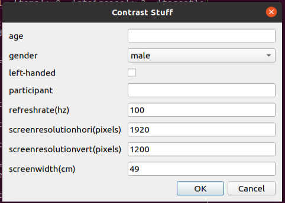
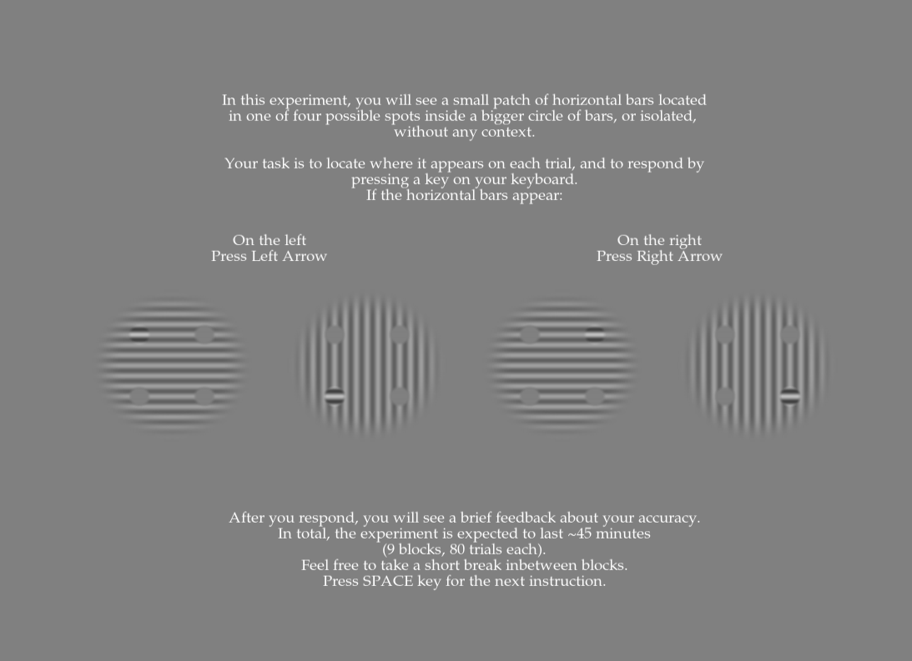

This repository is for orientation-dependent contextual modulation experiments,
as explained in Mannion et al. (2017) and Serrano-Pedraza et al. (2014)

The experiment uses the PsiMarginal staircase to define the contrast levels in
each trial. In order to do that, the PsiMarginal.py and Low_Hori_2afc.py should
always be in the same folder. 

The first prompt will ask you for information regarding the subject (age, etc.)
and your monitor (refresh rate, size). It is important to fill these in with
the correct information, because image presentation time is defined using the
refresh rate of the monitor.

The participant will see a display with a context and target grating in each
trial (or a target grating without any context), and should respond through
arrow keys whether the target grating appeared on a left-side or right-side
target location.

